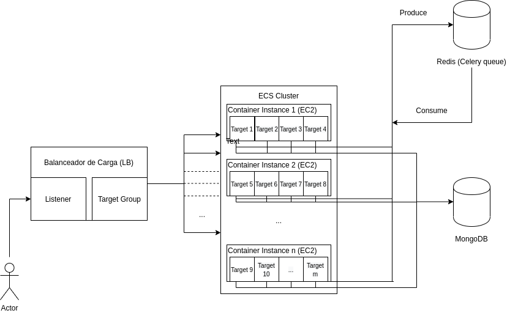

[](https://travis-ci.org/fermezz/mutants) [](https://coveralls.io/github/fermezz/mutants?branch=master)

# Mutants

## Cómo correr localmente

Para desarrollar localmente, sólo basta con tener instalado Docker y Docker Compose. Si no lo tenés, por favor [instalá Docker](https://docs.docker.com/engine/install/) y [Docker Compose](https://docs.docker.com/compose/install/) primero.

Una vez instalados Docker y Docker Compose, podemos correr `docker-compose up --build` en el directorio del proyecto y una vez finalizado tendremos el proyecto corriendo en `localhost:5000`.

Este comando usa el archivo de configuración [`docker-compose.yml`](https://github.com/fermezz/mutants/blob/master/docker-compose.yml) para orquestrar los containers necesarios para correr el proyecto en tu ambiente local.


## Anatomía

El proyecto tiene varios directorios dividiendo los componentes necesarios para ser ejecutado:

- `flaskr`: Donde vive el webserver de Flask y la aplicación per-se
    - `flaskr.api`: Definición de endpoints de la API y funcionalidad de las vistas de Flask
    - `flaskr.mutants`: Modelos y lógica del negocio del proyecto

- `infrastructure`: El directorio donde viven todos los archivos de configuración de Terraform con los que manejamos toda la infraestructura sobre la que corre el proyecto en AWS.
                    Cada uno de los archivos representa un recurso en AWS.

- `services`: Los servicios necesarios para correr el proyecto.
    - `services.nginx`: El container y la configuración de Nginx, que usamos como [reverse-proxy](https://en.wikipedia.org/wiki/Reverse_proxy).
    - `services.mongo`: Sólo usado en el ambiente de desarrollo, Dockerfile y scripts para generar la imagen de MongoDB que podremos correr en un container con Docker Compose

- `tests`: Los tests del proyecto
    - `tests.api`: Contiene los tests que verifican la lógica del `flaskr.api`
    - `tests.mutants`: Contiene los tests que verifican la lógica del `flaskr.mutants`
    - `tests.load`: Contiene un `locustfile`, que es el script que corremos con [Locust](https://locust.io/) para generar carga en el servidor

- `scripts`: Contiene scripts usados en nuestro CI


## Arquitectura


### Visión General de la Infraestructura
La infraestructura en AWS, se ve más o menos así




### Targets
Cada "Target X" es una Tarea de ECS corriendo en una máquina de EC2. El contenido de las tareas está definido por el archivo [container_definitions.json](https://github.com/fermezz/mutants/blob/master/infrastructure/container_definitions.json) como se puede ver en la [definición del cluster de ECS](https://github.com/fermezz/mutants/blob/master/infrastructure/ecs.tf#L27-L32) en la configuración de Terraform.


### Base de Datos
La base de datos es una instancia de MongoDB corriento en Atlas MongoDB. MongoDB está deployeado con un ReplicaSet de una instancia primaria y dos replicas. Es una [configuración bastante estándar](https://docs.mongodb.com/manual/replication/#replication-in-mongodb). De hecho, es la que viene por default en Atlas.

Elegimos MongoDB como base de datos por diferentes razones.

 1. El proyecto es nuevo y los datos no tienen mucha estructura. De hecho no existen relaciones entre dos o más entidades, por lo que una base de datos no-relacional no es mala idea.
 2. Las bases de datos no relacionales, al tener poca estructura, te permiten cambiar el enfoque de la solución al problema sin mucho esfuerzo.
 3. El uso que le vamos a dar –insertar instancias de humanos y preguntar la cantidad total de humanos mutantes/no mutantes– de hecho tiene mejor performance en MongoDB que en PostgreSQL
 4. Tenía ganas de divertirme un rato :)

#### PostgreSQL vs MongoDB

##### PostgreSQL

Primero creamos una base de datos en PostgreSQL

```
postgres=# create database test_database;
postgres=# \c test_database;
```

y generamos 100 millones de entradas

```
postgres=# create table test as select '{aaaa,aaaa,aaaa,aaaa}'::text[] as dna , (random() > 0.5)::boolean as is_mutant from generate_series(1, 100000000);

 dna                   | is_mutant
-----------------------+-----------
 {aaaa,aaaa,aaaa,aaaa} | t
 {aaaa,aaaa,aaaa,aaaa} | f
 {aaaa,aaaa,aaaa,aaaa} | t
 {aaaa,aaaa,aaaa,aaaa} | f
 {aaaa,aaaa,aaaa,aaaa} | t
 {aaaa,aaaa,aaaa,aaaa} | t
 ...

```

No nos importa cómo se ve acá `dna` porque lo que vamos a consultar constantemente en /stats/ es la cantidad de entradas filtrando por el valor de `is_mutant`.

```
test_database=# explain analyze select count(case when is_mutant then 1 end) as positive, count(case when not is_mutant then 1 end) as negative from test;


                                                               QUERY PLAN

--------------------------------------------------------------------------------------------------------------------------------------------------
Finalize Aggregate  (cost=1888887.12..1888887.13 rows=1 width=16) (actual time=47043.923..47043.923 rows=1 loops=1)
    ->  Gather  (cost=1888886.90..1888887.11 rows=2 width=16) (actual time=47043.214..47055.596 rows=3 loops=1)
      Workers Planned: 2
      Workers Launched: 2
      ->  Partial Aggregate  (cost=1887886.90..1887886.91 rows=1 width=16) (actual time=46956.715..46956.715 rows=1 loops=3)
            ->  Parallel Seq Scan on test  (cost=0.00..1602233.93 rows=57130593 width=1) (actual time=0.170..43528.696 rows=33333333 loops=3)
  Planning Time: 0.976 ms
  JIT:
     Functions: 11
     Options: Inlining true, Optimization true, Expressions true, Deforming true
     Timing: Generation 9.860 ms, Inlining 159.760 ms, Optimization 122.093 ms, Emission 83.051 ms, Total 374.763 ms
     Execution Time: 47065.049 ms (12 rows)
```


Tarda +47 segundos en hacer una consulta a la tabla sin ningún tipo de índice y siendo la primera consulta que se ejecuta.
Una siguiente consulta idéntica nos muestra que tarda la mitad.

```
                                                                QUERY PLAN

--------------------------------------------------------------------------------------------------------------------------------------------------
Finalize Aggregate  (cost=1656928.32..1656928.33 rows=1 width=16) (actual time=19489.772..19489.772 rows=1 loops=1)
   ->  Gather  (cost=1656928.10..1656928.31 rows=2 width=16) (actual time=19489.626..19494.604 rows=3 loops=1)
    Workers Planned: 2
    Workers Launched: 2
    ->  Partial Aggregate  (cost=1655928.10..1655928.11 rows=1 width=16) (actual time=19430.753..19430.753 rows=1 loops=3)
          ->  Parallel Seq Scan on test  (cost=0.00..1447594.73 rows=41666673 width=1) (actual time=0.181..16083.170 rows=33333333 loops=3)
  Planning Time: 0.257 ms
   JIT:
      Functions: 11
      Options: Inlining true, Optimization true, Expressions true, Deforming true
      Timing: Generation 2.439 ms, Inlining 138.463 ms, Optimization 108.631 ms, Emission 63.216 ms, Total 312.749 ms
      Execution Time: 19496.048 ms (12 rows)
```

Y el resultado:

```
test_database=# select count(case when is_mutant then 1 end) as positive, count(case when not is_mutant then 1 end) as negative from test;
  positive | negative
 ----------+----------
  49998047 | 50001953
```

Ahora hacemos lo mismo pero esta vez creamos un índice en `is_mutant`

```
create index on test (is_mutant);
```


```
                                                                    QUERY PLAN

--------------------------------------------------------------------------------------------------------------------------------------------------
 Finalize Aggregate  (cost=1656928.22..1656928.23 rows=1 width=16) (actual time=19985.045..19985.046 rows=1 loops=1)
    ->  Gather  (cost=1656928.00..1656928.21 rows=2 width=16) (actual time=19984.898..19993.683 rows=3 loops=1)
     Workers Planned: 2
     Workers Launched: 2
     ->  Partial Aggregate  (cost=1655928.00..1655928.01 rows=1 width=16) (actual time=19899.364..19899.365 rows=1 loops=3)
        ->  Parallel Seq Scan on test1  (cost=0.00..1447594.67 rows=41666667 width=1) (actual time=0.171..16369.714 rows=33333333 loops=3)
   Planning Time: 3.778 ms
    JIT:
       Functions: 11
       Options: Inlining true, Optimization true, Expressions true, Deforming true
       Timing: Generation 12.033 ms, Inlining 166.114 ms, Optimization 147.029 ms, Emission 96.854 ms, Total 422.030 ms
       Execution Time: 20006.250 ms (12 rows)
```


20 segundos. Tiene sentido que el índice no ayude por la baja cardinalidad que tienen los valores booleanos y cómo están repartidos –sólo hay dos valores posibles.


##### MongoDB

Ahora probamos lo mismo pero con MongoDB

En una única colección, insertamos 100M de documentos

```
import random

from pymongo import MongoClient

client = MongoClient()
db = client.test_database

collection = db.collection
booleans = [True, False]

for i in range(100):
    print("Inserting humans...")
    collection.insert_many(({"dna": ["aaaa", "aaaa", "aaaa", "aaaa"], "is_mutant": booleans[random.randint(0, 1)]}) for _i in range(1000000))
    print("Sleeping for a while...")
    time.sleep(3)
```

Y hacemos una query similar a la que hicimos en PostgreSQL

```
def benchmark():
  t1 = datetime.datetime.now()
  mc.test_database.collection.aggregate(
      [
          {
              '$group': {
                  '_id': 1,
                  'mutants': {'$sum': {'$cond': [{'$eq': ['$is_mutant', True]}, 1, 0]}},
                  'nonmutants': {'$sum': {'$cond': [{'$eq': ['$is_mutant', False]}, 1, 0]}},
              },
          },
      ],
  )
  print(datetime.datetime.now() - t1) 

benchmark()
>> 0:01:26.493130
```

Tarda 1 minuto 26 segundos. ¡Incluso más que PostgreSQL!

¿Entonces por qué elegí MongoDB?


##### Estimación de la cantidad total de entradas

Resulta que en los dos PostgreSQL y MongoDB podemos, en vez de realmente contar todas las entradas que hay en una tabla/colección sacar una estimación de la cantidad total de entradas que hay en un momento determinado.

Con PostgreSQL, lo podemos hacer a través de [estadísticas de la tabla `pg_class`](https://wiki.postgresql.org/wiki/Count_estimate) pero así y todo tarda ~300ms y para tener un resultado más o menos acertado, hay que [configurar PostgreSQL para correr `VACUUM ANALYZE`](https://wiki.postgresql.org/wiki/Introduction_to_VACUUM,_ANALYZE,_EXPLAIN,_and_COUNT#Using_ANALYZE_to_optimize_PostgreSQL_queries) seguido.

Entonces fui a MongoDB y descubrí que se puede correr una [función `estimatedDocumentCount`](https://docs.mongodb.com/manual/reference/method/db.collection.estimatedDocumentCount/) contra las colecciones que es súper rápida –2ms– y 100% precisa la mayor parte del tiempo, salvo algunos escenarios en particular.

Pero, ¿cómo hacemos para identificar cuáles son mutantes con esa función?

Creamos dos colecciones en vez de una.

Podemos tener una colección `mutant` y una `non_mutant` para mutantes y no mutantes respectivamente y de esta manera siempre podemos usar la función estimatedDocumentCount para saber la cantidad de mutantes/no mutantes que tenemos en nuestra base de datos, en vez de hacer operaciones para filtrar booleanos que es mucho más lento.

```
import time
from pymongo import MongoClient

client = MongoClient()

db = client.test_database

mutants_collection = db.mutants_collection
non_mutants_collection = db.non_mutants_collection

for i in range(50):
    print("Inserting mutants...")
    mutants_collection.insert_many(({"dna": ["aaaa", "aaaa", "aaaa", "aaaa"]}) for _i in range(1000000))
    print("Inserting non mutants...")
    non_mutants_collection.insert_many(({"dna": ["aaaa", "aaaa", "aaaa", "aaaa"]}) for _i in range(1000000))

    print("Sleeping for a while...")


def benchmark2():
  t1 = datetime.datetime.now()
  mutants_collection.estimated_document_count()
  non_mutants_collection.estimated_document_count()
  print(datetime.datetime.now() - t1)

benchmark2()
>> 0:00:00.002165 # Blazing fast, accurate response
```
